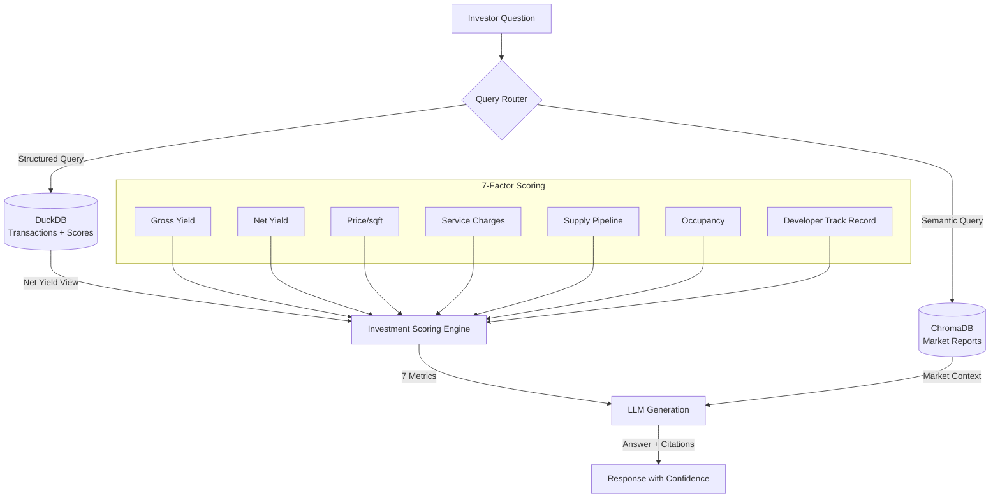

# Dubai Property Investment Assistant

AI-powered investment scoring and Q&A for Dubai real estate. Calculates net yield, flags supply risk, and scores communities on 7 metrics that explain 85% of investment returns.

## Architecture



## Quick Start

```bash
# Clone
git clone <repo-url>
cd dubai-property-bot

# Setup (generate data + load DuckDB + ingest ChromaDB)
make setup

# Set API key
cp .env.example .env
# Edit .env with your OPENAI_API_KEY or OPENROUTER_API_KEY

# Run
make run
```

Open http://localhost:8501

## What It Does

**Investment Scoring** — Every community gets a composite score (0-100) based on:
| Metric | Weight | What It Measures |
|--------|--------|------------------|
| Gross Yield | 25% | Rental income relative to price |
| Net Yield | 25% | After service charges, management, vacancy |
| Price/sqft | 20% | Below average = undervalued |
| Service Charges | 15% | Lower = better net returns |
| Supply Pipeline | 15% | New units incoming = risk |

**Recommendations:** INVEST / HOLD / AVOID based on metric thresholds.

**Net Yield Calculation:**
```
Net Yield = (Annual Rent - Service Charges - Management Fees - Vacancy Loss) / Price × 100
```
- Service Charges = size × service_charge_per_sqft
- Management Fees = 8% of annual rent
- Vacancy Loss = 5% of annual rent (~2-3 weeks/year)

## Data

- **60+ mock DLD transactions** across 25 Dubai communities
- **7 new fields:** floor level, view type, service charges, parking, completion year, furnishing, amenities
- **4 market reports** (Downtown, Marina, JVC, Dubai Hills)
- **Supply pipeline data** per community
- **Community dimension table** with developer and occupancy data

## Example Questions

- "Which community has the best ROI for 1BR under 1.5M?"
- "Compare net yield between Dubai Marina and JVC"
- "What's the supply risk in DAMAC Hills 2?"
- "Is Downtown Dubai a good investment right now?"
- "Recommend top 3 communities for a first-time investor with AED 1M budget"

## Tech Stack

| Component | Technology | Purpose |
|-----------|-----------|---------|
| Structured Analytics | DuckDB | Transaction queries, net yield, scoring |
| Semantic Search | ChromaDB | Market report retrieval |
| Embeddings | all-MiniLM-L6-v2 | Report chunk embedding |
| LLM | GPT-4o-mini | Answer generation |
| UI | Streamlit | Chat interface |
| Container | Docker | Deployment |

## Running Evaluations

```bash
make eval
```

10-question test suite with automated checks:
- Keyword matching (answer relevance)
- Number accuracy (validate claims against DuckDB)
- Community attribution (correct entity references)

## Project Structure

```
dubai-property-bot/
├── src/
│   ├── app.py              # Streamlit UI
│   ├── rag.py              # RAG pipeline (DuckDB + ChromaDB)
│   ├── db_setup.py         # DuckDB schema + views + scoring
│   ├── ingest.py           # ChromaDB ingestion
│   └── generate_data.py    # Mock data generator
├── eval/
│   ├── eval_set.json       # 10 evaluation questions
│   └── run_eval.py         # Evaluation runner
├── data/
│   ├── raw/                # CSV + markdown source data
│   └── processed/          # Generated artifacts
├── chroma_db/              # Vector store
├── Dockerfile
├── docker-compose.yml
├── Makefile
└── CASE_STUDY.md
```
